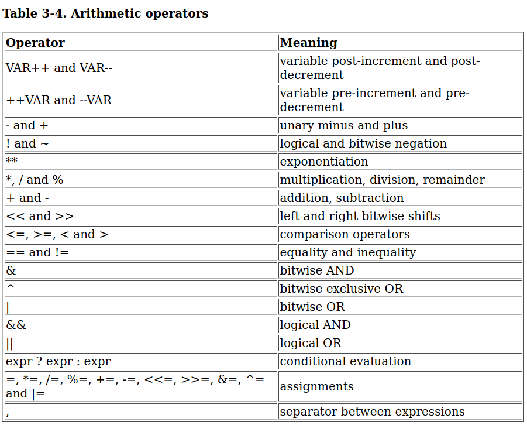

# Shell expansions

## Metacharacters and various shell expansions

> A character that, when unquoted, separates words. A metacharacter is a space, tab, newline, or one of the following characters: `|, &, ;, (, ), <, >`.

## [Shell operation](https://unix.stackexchange.com/questions/388345/behaviour-of-bash-command-substitution-with-command-from-string-in-variable)

> The brief description of the shell’s operation when it reads and executes a command. Basically, the shell does the following:
>
> 1. Reads its input.
> 2. Breaks the input into words and operators, obeying the quoting rules. These tokens are separated by metacharacters.
> 3. Parses the tokens into simple and compound commands.
> 4. Performs the various shell expansions.
> 5. Performs any necessary redirections.
> 6. Executes the command

All the below mentioned expansions happen at step 4.

> There are seven kinds of expansion. The order of expansions is:
>
> 1. Brace expansion,
> 2. Tilde expansion,
> 3. Parameter and variable expansion,
> 4. Arithmetic expansion and
> 5. Command substitution (done in a left-to-right fashion)
> 6. Word splitting and
> 7. Filename expansion

## 1. Brace expansion

**{}** expands the character sequence present inside the braces. Can expand the sequences in ascending as well as descending order.

```Bash
echo {a..z}

# can be thought of like range function in programming languages.
for i in {0..20}
do
  echo $i
done

# character combination
echo {a..z}{a..z}
echo {1..2}{1..2}

echo {1,2}{1..3}

# empty item with {,}
echo {,1}{a..c} # outputs a b c 1a 1b 1c

# expand string with multiple prefixes
echo {a..z}hello
# above can be used with wildcard characters to expand to pathnames
echo {/etc,/lib}/*.so*
for file in {/etc,/lib}/*.so*
do
echo $file
done
```

## 2. Tilde expansion

* `~+` - Shell variable `PWD` replaces the `~` prefix
* `~-` - Shell variable `OLDPWD` replaces the `~` prefix
* `~/Downloads` - Shell variable `HOME` replaces `~`.  If `HOME` is unset, the home directory of the user executing the shell is substituted instead.

## `$` expansions

The `$` character introduces parameter expansion, command substitution, or arithmetic expansion.

### 3. Parameter Expansion

> * The parameter name or symbol to be expanded may be enclosed in braces, which are optional but serve to protect the variable to be expanded from characters immediately following it which could be interpreted as part of the name.
> * The basic form of parameter expansion is `"${PARAMETER}"`.
> * The braces are required when "PARAMETER" is a positional parameter with more than one digit,(`${10}`) or when "PARAMETER" is followed by a character that is not to be interpreted as part of its name (`${name}:Hello`).
> -[Parameter expansion](https://tldp.org/LDP/Bash-Beginners-Guide/html/sect_03_04.html)

```Bash
echo $SHELL

# Notice {} separate variable name from the rest of the text.
echo "${BASHPID}, is current bash process id"
```

* > If the first character of "PARAMETER" is an exclamation point, Bash uses the value of the variable formed from the rest of "PARAMETER" as the name of the variable; this variable is then expanded and that value is used in the rest of the substitution, rather than the value of "PARAMETER" itself. This is known as **indirect expansion**.

```Bash
name='John Doe'
name_ref='name'
# prints John Doe
echo "${!name_ref}"
```

* Indirect expansion can be used to get all the shell variables starting with a pattern (but pattern is very restricted match can be made only at the beginning).

```Bash
# first BASH* is considered as the name of the variable and it
# is expanded to match all the variable names in the current shell scope
# starting with B and those matched names get substituted.

BOX=1
echo ${!BASH*}
# Outputs BASH BASHOPTS BASHPID BASH_ALIASES BASH_ARGC BASH_ARGV BASH_ARGV0
# BASH_CMDS BASH_COMMAND BASH_LINENO BASH_SOURCE BASH_SUBSHELL BASH_VERSINFO
# BASH_VERSION BOX

# but the above results can be better achieved with compgen shell builtin
# with greater flexibility
compgen -v BASH

```

### 4. Arithmetic Expansion

`(())` - This is arithmetic expression. `$(())` is arithmetic expansion. In arithmetic expansion, `$(())` is replaced with the result of the arithmetic expression.

```Bash
declare -i a=5 b=10 c=6
# arithmetic expansion
result=$(($a + $b * $c - 100))
echo "Computation result : $result"
# within arithmetic expression $ is optional
# for referencing variable values.
echo $((a + b * c - 100))
unset a b c
```



Bash performs only **integer math**. Bash **doesnot** know about floats, long, doubles. For floating point arithmetic, we need to use external library like **bc**.

* Arithmetic expansions can be nested `echo $((5 + $((2 * 10)) ))`

**NOTE**: Wherever possible, Bash users should try to use the syntax with square brackets. `$[]` does not do any condition checks like `[](test)` operator.

```Bash
# Spaces can be liberally used to separate operators and operands.
echo $[ 10 * 15 ]
```

### 5. Command Substitution

`$()` or ``(backticks) - command substitution.

* Creates a **subshell**, passes the expression inside `$()` or backticks, replaces the same with the stdout of the evaluated expression.
* Backticks usage not recommended because it is **not POSIX** compatible as well as it cannot be nested as elegantly like `$(cmd1 $(cmd2))`.

```Bash
echo $(pwd)
echo $(whoami)

# nesting in command substitution
# in the above command echo "user:$(whoami)" is
# executed in a subshell and the result user:xyz
# is returned and after replacement the statement looks like echo "user:xyz"
echo "$(echo "user:$(whoami)")"

# Inner echo prints the PID of the subshell and the BASHPID
# in the outer echo prints the PID of the current shell
echo $(echo $BASHPID) $BASHPID
```

## 6. Word splitting

> The shell scans the results of parameter expansion, command substitution, and arithmetic expansion **that did not occur within double quotes** for word splitting followed by filename expansion.

* For word splitting, shell variable `IFS` is used. By default `IFS` is set to `'<space><tab><newline>'`. If `IFS` is set to `null`, no word splitting occurs.

**NOTE**- If none of the expansions occur, then no word splitting is performed.

```Bash
# Below is the output with set -xv
# +++ whoami
# ++ echo 'user:     root'
# + echo user: root
# user: root
echo $(echo "user:     $(whoami)")

# With IFS set to null
OLDIFS=IFS
IFS=
echo $(echo "user:     $(whoami)")
# notice no word splitting happens
# +++ whoami
# ++ echo 'user:     root'
# + echo 'user:     root'
# user:     root
```

## 7. Filename expansion

* `set -o noglob` or `set -f` disables filename expansion.
* Filename expansion is not done on double quoted strings.
* Expands glob patterns to matching file names in the current working directory and the matched filenames are sorted in alphabetical order.

```Bash
pattern="t*   s*"
# parameter substitution happens
# word splitting is done next
# command becomes `echo t* s*`
# filename expansion follows next
# this command prints all the filenames starting with t and s
echo $pattern

# no word splitting and no filename expansion since the result
# is enclosed within double quotes.
# prints 't*   s*'
echo "$pattern"
```

**NOTE** - Parameter expansion, arithmetic expansion and command substitution happen only in strings enclosed within double quotes.

---

## References

* [Bash Guide by Joseph Deveau](https://www.amazon.in/BASH-Guide-Joseph-DeVeau-ebook/dp/B01F8AZ1LE/ref=sr_1_4?keywords=bash&qid=1564983319&s=digital-text&sr=1-4)

* [Command substitution](https://linuxhint.com/bash_shell_brace_parameter_expansion)
